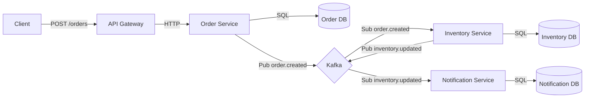

# Order Processing EDA

Event-Driven Architecture project using FastAPI, Kafka, and PostgreSQL.

## Overview
We have built a microservices-based Event-Driven Architecture handling order processing.

### Architecture



### Services Implemented
1.  **API Gateway**: Forwards requests to Order Service.
2.  **Order Service**: Creates order, persists to DB, publishes event.
3.  **Inventory Service**: Consumes order event, updates inventory/log, publishes inventory event.
4.  **Notification Service**: Consumes inventory event, logs notification.

## Prerequisites
- Docker & Docker Compose
- Python 3.10+
- `uv` (recommended) or `pip`

## Setup & Run

### 1. Infrastructure
Start PostgreSQL and Kafka. 
*Note: Kafka is pinned to version 7.4.0, and Postgres listens on port 5433 locally.*

```bash
# Start Postgres & PgAdmin
docker-compose -f postgres/docker-compose.yml up -d

# Start Kafka & Zookeeper
docker-compose -f kafka/docker-compose.yml up -d
```

Ensure databases are created (`orders_db`, `inventory_db`, `notification_db`). They should be auto-created by the init script.
PgAdmin is available at `localhost:5050` (user: `admin@admin.com`, pass: `admin`).

### 2. Services
The easiest way to run all services is using the helper script:

```bash
chmod +x run_dev.sh
./run_dev.sh
```

This will run:
- **API Gateway** (Port 8000)
- **Order Service** (Port 8001)
- **Inventory Service** (Port 8002)
- **Notification Service** (Port 8003)

*Services have automatic retry logic for Kafka connections, so allow a few seconds for them to fully initialize.*

### 3. Testing
Create an order:

```bash
curl -X POST http://localhost:8000/orders \
  -H "Content-Type: application/json" \
  -d '{"item_id": "item-123", "quantity": 1}'
```

### Flow Verification
1.  **Request**: `POST /orders` sent to API Gateway.
2.  **Order Service**: Creates order in `orders_db` and publishes `order.created`.
3.  **Inventory Service**: Consumes `order.created`, updates `inventory_db`, and publishes `inventory.updated`.
4.  **Notification Service**: Consumes `inventory.updated` and logs to `notification_db`.

Check the terminal logs or PgAdmin to verify the data flow.
